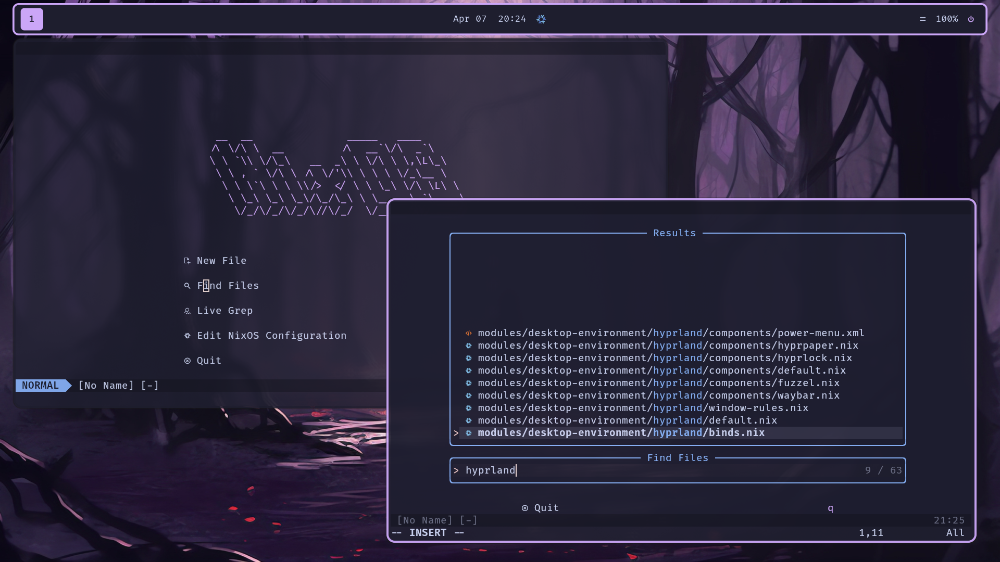

<h1 align="center">
     
     NixOS Configuration Files
     
</h1>

Written and configured with:

Multi-host configuration files for my NixOS machines.

### What is Nix/NixOS?
NixOS is an atomic, declarative, immutable GNU/Linux distribution that offers both rolling and
stable releases ([More Info](https://en.wikipedia.org/wiki/NixOS)). I tried NixOS in June 2024
and have been daily driving it since around that time.

Host Devices
------------
| Hostname | Device Type     | Primary Purpose | Namesake                                                                                 |
|----------|-----------------|-----------------|------------------------------------------------------------------------------------------|
| vaal     | Laptop          | School          | [Vaal River, South Africa](https://en.wikipedia.org/wiki/Vaal_River)                     |
| RioTinto | Desktop         | Gaming          | [Rio Tinto, Spain](https://en.wikipedia.org/wiki/Rio_Tinto_(river))                      |
| tokoro   | Server          | File Backups    | [Tokoro River, Japan](https://en.wikipedia.org/wiki/Tokoro_River)                        |
| wsl      | Virtual Machine | WSL Config      | [Windows Subsystem for Linux](https://en.wikipedia.org/wiki/Windows_Subsystem_for_Linux) |

##### Note on Names
We have a long-standing tradition at my house to name all
devices after a river. After a few decades of this, basic
names like "Nile" are long gone. These particular names
are based primarily on cultural interests of mine.

Screenshots
-----------

Screenshots taken on vaal.

Related Projects
----------------
A few of my other projects are dependencies of my flake. Most aren't really intended
for public use, but mkdev is!
- [Mkdev](https://github.com/4jamesccraven/mkdev): Utility to eliminate boilerplate
- [nx](https://github.com/4jamesccraven/nx): A wrapper for the nix CLI (glorified shell script)
- [Warframe Bot](https://github.com/4jamesccraven/warframe-bot): A discord bot that posts
  [warframe](https://www.warframe.com/) news

Directory Structure
-------------------
-  Assets - static assets for certain applications
-  Hosts - entry points for the configs
-  Custom Derivations - Scripts etc. that I packaged
-  Modules - Everything else
   - Dots - specific applications, mostly cli
   - Desktop Environments - Self-explanatory
