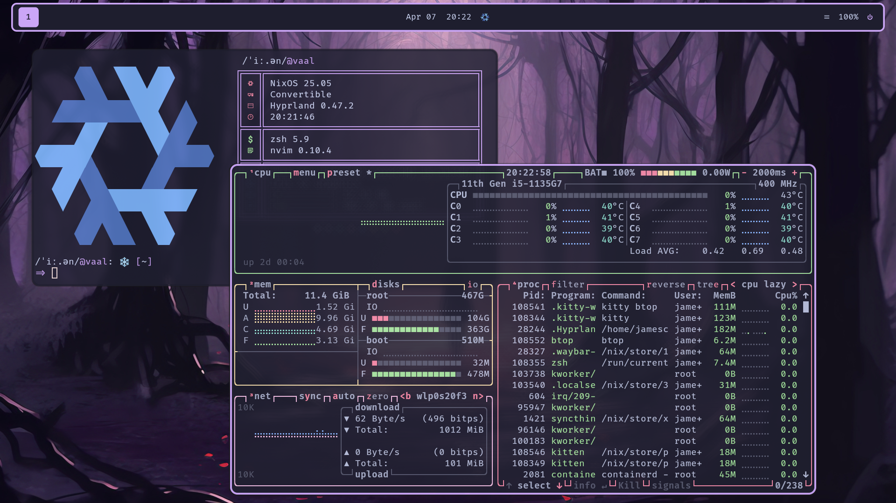

<h1 align="center">
     
     NixOS Configuration Files
     
</h1>

<div align="center">
Written and configured with:


</div>

Multi-host configuration files for my NixOS machines.

### What is Nix/NixOS?
NixOS is an atomic, declarative, immutable Linux distribution that offers both rolling and
stable releases ([More Info](https://en.wikipedia.org/wiki/NixOS)). I tried NixOS in June 2024
and have been daily driving it since around that time.

Host Devices
------------
| Hostname | Device Type     | Primary Purpose       | Namesake                                                                                 |
|----------|-----------------|-----------------------|------------------------------------------------------------------------------------------|
| vaal     | Laptop          | School                | [Vaal River, South Africa](https://en.wikipedia.org/wiki/Vaal_River)                     |
| RioTinto | Desktop         | Gaming                | [Rio Tinto, Spain](https://en.wikipedia.org/wiki/Rio_Tinto_(river))                      |
| tokoro   | Server          | Jellyfin/File Backups | [Tokoro River, Japan](https://en.wikipedia.org/wiki/Tokoro_River)                        |
| wsl      | Virtual Machine | WSL Config            | [Windows Subsystem for Linux](https://en.wikipedia.org/wiki/Windows_Subsystem_for_Linux) |

##### Note on Names
We have a long-standing tradition at my house to name our devices after a
river. After a few decades of this, basic names like "Nile" are long gone.
These particular names are based primarily on cultures that I find intriguing
or have a connection with.

Screenshots
-----------


<div align="center"><i>Screenshots taken on vaal (note: this is slightly outdated).</i></div>

Config Design Philosophy
------------------------
The setup for my system is heavily inspired by Rust traits, and these traits
define reusable definitions of the capabilites of my systems.

Some traits define the general type of system that I'm building. This allows
me to compose functionality without repeating myself, and creates the
necessary granularity to define systems with complex use cases. The current
hierarchy looks something like this:
```
Any
 ├─ Machine
 │    ├─ Graphical
 │    │    └─ Workstation
 │    └─ Server
 └─ WSL
```
Where `Any` is the most general and `Workstation` is the most specific.

There also several traits that define additional functionality/requirements
for a given system. Note that some of the hierarchical traits imply the
the presence of extension traits. For example all systems have the `Neovim`
trait (because I will always need to edit text on any system).

The current list is as follows:
- neovim
- gaming
- jellyfin-service
- nvidia
- syncthing
- virtualisation

##### Current traits applied to each system
- RioTinto: Workstation + Gaming + Nvidia
- Vaal: Workstation
- Tokoro: Server + Syncthing + JellyfinService
- wsl: WSL

Personal Dependencies
----------------
A few of my other projects are dependencies of my flake.
- [Mkdev](https://github.com/4jamesccraven/mkdev): Command-line templating
  engine primarily intended to speed up creating new projects (a la Cargo).
- [4jamesccraven/neovim](https://github.com/4jamesccraven/neovim): my neovim
  config.

Directory Structure
-------------------
- Assets - Static assets for certain applications
- Hosts - Entry points for the configs
- Overlay - Random things I've packaged and overlayed into my local `nixpkgs`.
- Utils - Custom nix utilities
- Modules - Everything else
   - Dots - Configurations for specific applications
   - Traits - Definitions of the capabilities a host can have
   - Constants - Variables that may be re-used in multiple places.
